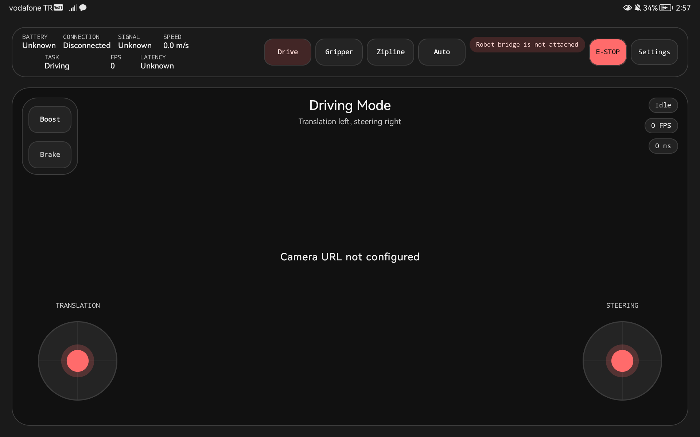
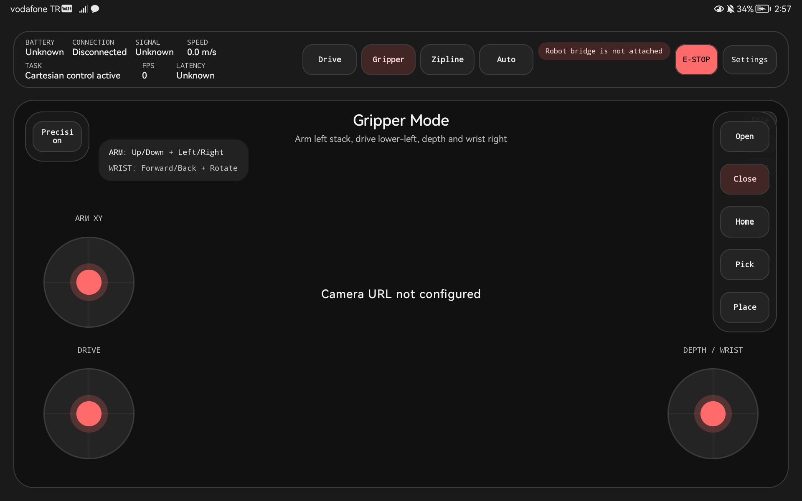
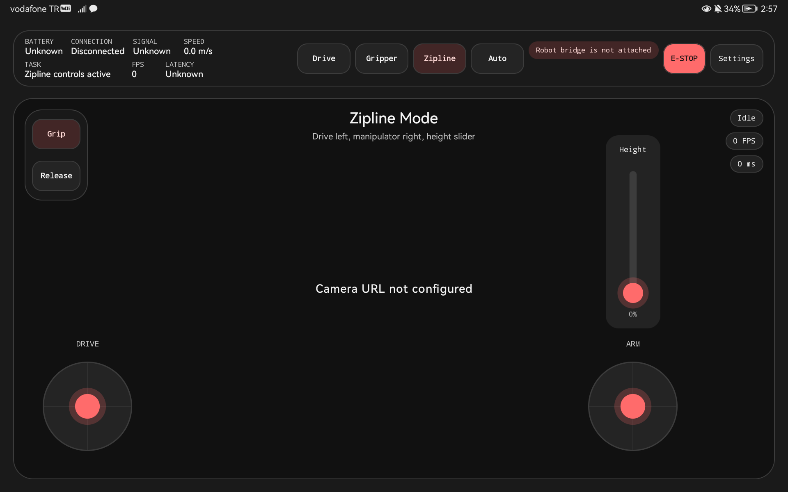
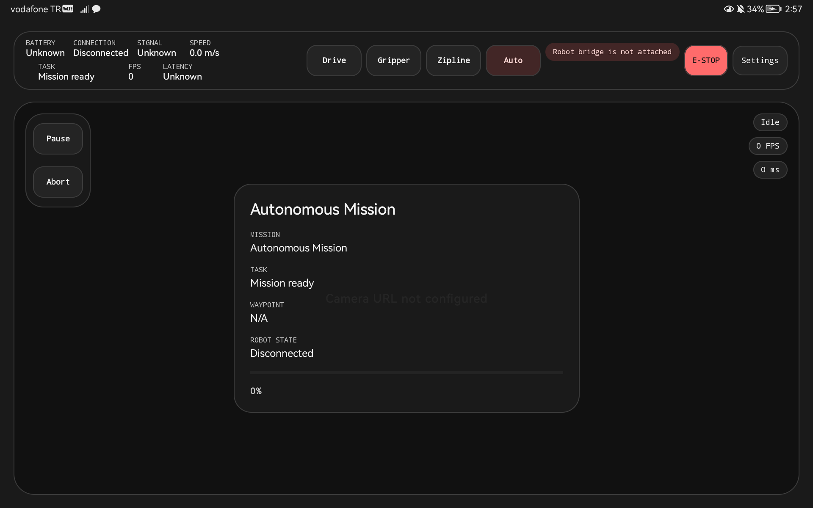
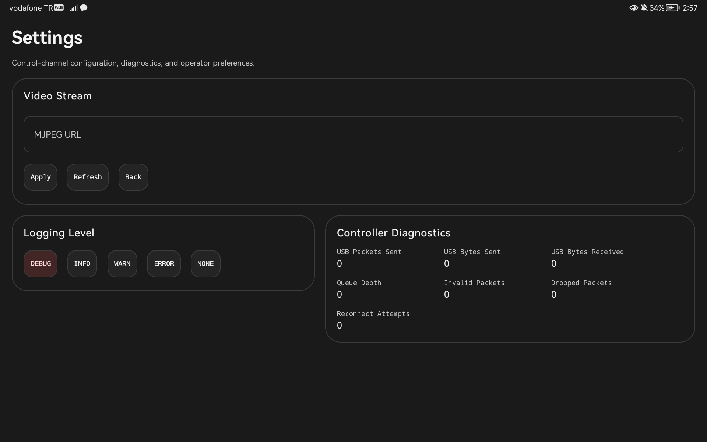
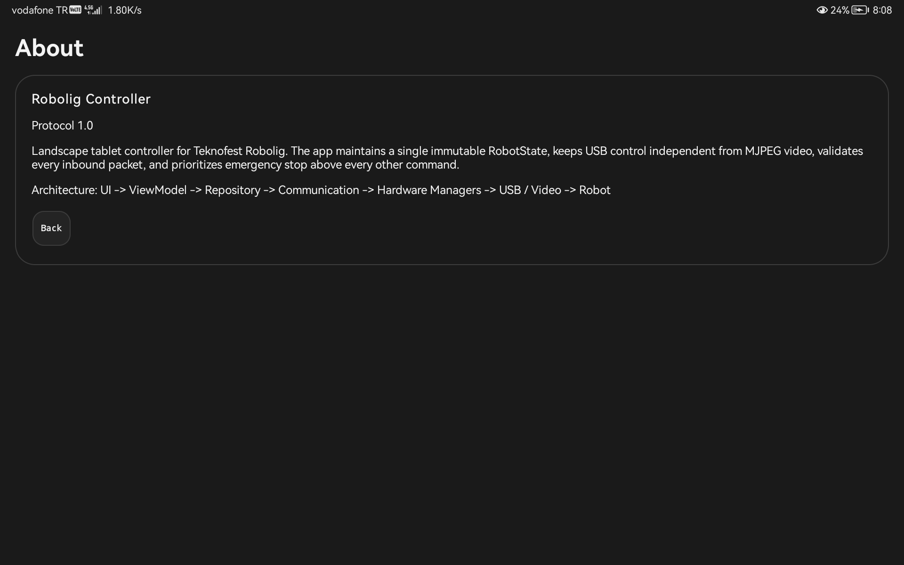

# Robolig Controller

Production-oriented Android controller for the Teknofest Robolig robot.

The project follows the repository specifications in this order:

1. `REQUIREMENTS.md`
2. `PROTOCOL.md`
3. `DESIGN.md`
4. `ARCHITECTURE.md`
5. `TASK.md`

The official UI reference image is `docs/UI/robot app DesignV2_1.png`.

## System Summary

- Platform: Android, minimum API 26
- Language: Kotlin
- UI: Jetpack Compose + Material 3
- Architecture: MVVM + Hilt + Flow/StateFlow
- Robot control transport: USB serial at `115200` baud through Deneyap Mini v2
- Video transport: independent WiFi MJPEG stream
- Packet size: fixed `32` bytes
- Safety: heartbeat, watchdog, auto-stop, emergency stop, packet validation, checksum validation, sequence validation

## Architecture

Dependency direction is kept as:

`UI -> ViewModels -> Repositories -> Communication Layer -> Hardware Managers -> USB / Video -> Robot`

Key packages:

- `app/src/main/kotlin/com/robolig/controller/presentation`: screens, navigation, components, theme
- `app/src/main/kotlin/com/robolig/controller/domain`: immutable models and repository contracts
- `app/src/main/kotlin/com/robolig/controller/data`: repository implementation and controller adapters
- `app/src/main/kotlin/com/robolig/controller/communication`: control loops, queueing, heartbeat, watchdog, inbound/outbound processing
- `app/src/main/kotlin/com/robolig/controller/protocol`: packet model, checksum, encoder, parser, decoder, packet factory
- `app/src/main/kotlin/com/robolig/controller/usb`: USB permission and serial managers
- `app/src/main/kotlin/com/robolig/controller/video`: MJPEG stream manager and decoder
- `app/src/main/kotlin/com/robolig/controller/robot`: state factory and arm kinematics

## Control Modes

- `Drive`: translation joystick, steering joystick, boost, brake, emergency stop
- `Gripper`: Cartesian arm control, wrist rotation, precision mode, presets, gripper open/close
- `Zipline`: drive joystick, manipulator joystick, height slider, grip/release
- `Auto`: mission state, waypoint progress, pause/resume, abort

## Protocol Notes

- Header byte: `0xAA`
- Packet types: vehicle, arm, PTZ, telemetry request/response, emergency stop, heartbeat
- Sequence number: unsigned 8-bit rollover counter
- Timestamp: 3-byte millisecond counter since app start
- Checksum: XOR of bytes `0..30`, written to byte `31`
- Invalid packets are rejected by header, length, checksum, type, sequence, and payload validation

## Build And Verification

Use a writable Gradle cache location when needed:

```bash
env GRADLE_USER_HOME=/tmp/robolig-gradle ./gradlew --no-daemon ktlintFormat detekt testDebugUnitTest assembleDebug
```

Useful targets:

```bash
env GRADLE_USER_HOME=/tmp/robolig-gradle ./gradlew --no-daemon compileDebugKotlin
env GRADLE_USER_HOME=/tmp/robolig-gradle ./gradlew --no-daemon connectedDebugAndroidTest
```

## Device Verification

The current development device is detected through:

```bash
/home/mainframe/Android/Sdk/platform-tools/adb devices -l
```

If `connectedDebugAndroidTest` fails with `INSTALL_FAILED_USER_RESTRICTED` on Xiaomi/MIUI devices, enable the following on the phone:

1. Developer options
2. `USB debugging`
3. `USB debugging (Security settings)` if present
4. `Install via USB`
5. Any install confirmation prompt shown after `adb` starts the APK install

Package verifier was disabled for ADB installs during local testing with:

```bash
/home/mainframe/Android/Sdk/platform-tools/adb shell settings put global package_verifier_enable 0
/home/mainframe/Android/Sdk/platform-tools/adb shell settings put global verifier_verify_adb_installs 0
```

MIUI can still reject installation until its own security prompt is accepted on-device.

## Safety Expectations

- Emergency stop packets must always preempt queued traffic
- USB control failure must leave the robot in a safe stopped state
- Video failure must not block USB control
- USB failure must not silently corrupt or stall video state handling
- All operator-visible UI state must originate from the immutable `RobotState`

## Repository Status

Current local verification completed successfully for:

- `ktlintFormat`
- `detekt`
- `testDebugUnitTest`
- `assembleDebug`

Instrumentation packaging is healthy, but full connected execution remains device-blocked until MIUI allows APK installation over USB.


# Robolig Controller Detailed Documentation

This document explains the current Android tablet UI, the purpose of each page, the function of each major component, and the runtime flow behind the app.

The screenshots in this file were captured on the connected Huawei `AGS6-L09` tablet on July 2, 2026. The capture session was disconnected from the robot and had no MJPEG URL configured, so the images show placeholder camera and telemetry states.

The current operator top bar contains `Drive`, `Gripper`, `Zipline`, `Auto`, a warning chip, `E-STOP`, and `Settings`. The `About` page still exists in navigation, but it is no longer exposed by a top-bar button.

## Runtime flow at a glance

```text
Operator touch
  -> Compose component
  -> Screen action callback
  -> ViewModel
  -> RobotRepository controller adapter
  -> CommunicationStateStore mutation
  -> OutboundCommandScheduler builds packets
  -> CommandQueue prioritizes them
  -> PacketTransmitter writes raw bytes to USB serial
  -> Robot responds with heartbeat and telemetry
  -> InboundPacketProcessor validates and applies the response
  -> RobotStateFactory combines communication state + camera state
  -> StateFlow<RobotState> updates Compose UI
```

```text
SettingsScreen stream URL change
  -> ControllerPreferences
  -> VideoStreamManager restart loop
  -> CameraState update
  -> RobotStateFactory merge
  -> CameraView recomposition
```

## Shared operator frame

The `Drive`, `Gripper`, `Zipline`, and `Auto` pages all share the same shell built from these files:

- [MainActivity.kt](app/src/main/kotlin/com/robolig/controller/presentation/MainActivity.kt)
- [NavigationGraph.kt](app/src/main/kotlin/com/robolig/controller/presentation/navigation/NavigationGraph.kt)
- [RobotControlScaffold.kt](app/src/main/kotlin/com/robolig/controller/presentation/components/RobotControlScaffold.kt)
- [TelemetryBar.kt](app/src/main/kotlin/com/robolig/controller/presentation/components/TelemetryBar.kt)
- [CameraView.kt](app/src/main/kotlin/com/robolig/controller/presentation/components/CameraView.kt)
- [ControlJoystick.kt](app/src/main/kotlin/com/robolig/controller/presentation/components/ControlJoystick.kt)
- [ControlButtons.kt](app/src/main/kotlin/com/robolig/controller/presentation/components/ControlButtons.kt)

### MainActivity

`MainActivity` is the Compose entry point.

- It enables edge-to-edge rendering.
- It applies `RoboligTheme`.
- It mounts `NavigationGraph()` inside a full-screen `Surface`.
- It does not contain business logic.

### NavigationGraph

`NavigationGraph` owns routing between the pages.

- Start destination is `Drive`.
- It creates the correct ViewModel set per route with `hiltViewModel()`.
- It collects `robotState` from the repository-backed ViewModels with `collectAsStateWithLifecycle()`.
- Each routed control page uses `LaunchedEffect(Unit)` to push the selected `RobotMode` into the communication state.
- `Settings` and `About` are separate routes outside the shared control scaffold.

### RobotControlScaffold

`RobotControlScaffold` is the reusable frame for all operator control modes.

- It applies safe-drawing padding for top and horizontal system insets.
- It renders the `TelemetryBar` first.
- It renders `CameraView` as the large background panel.
- It accepts page-specific `overlayContent` that is drawn on top of the camera panel.
- It builds the left rail from `sideActions`.
- It optionally renders a right rail with `rightRailContent`.

`RailActionStyle` controls how rail buttons behave.

- `STANDARD`: regular click button.
- `TOGGLE`: latched accent state.
- `MOMENTARY`: emits pressed `true` on touch down and `false` on release.

### TelemetryBar

`TelemetryBar` is the thin shared status and command strip at the top.

- Left cluster:
  - Battery
  - Connection
  - Signal
  - Speed
  - Task
  - FPS
  - Latency
- Right cluster:
  - Mode buttons for `Drive`, `Gripper`, `Zipline`, `Auto`
  - First warning chip, if any
  - Compact `E-STOP`
  - Compact `Settings`

Important helpers inside `TelemetryBar`.

- `TelemetryItem`: a two-line metric cell with uppercase label and one-line value.
- `WarningChip`: shown only when `robotState.warnings.firstOrNull()` is present.
- `CompactTextButton`: compact utility button styling used by `Settings`.

### CameraView

`CameraView` fills the large main panel behind each control mode.

- If `cameraState.frameBytes` is available, it decodes a bitmap and crops it to the panel.
- If no frame exists, it shows a placeholder message based on `CameraStreamStatus`.
- It always overlays status badges at the top-right:
  - stream status
  - FPS
  - latency
  - retry count when reconnecting

Important helpers inside `CameraView`.

- `CameraPlaceholder`: chooses the idle, configured, connecting, streaming, or error message.
- `CameraOverlay`: stacks the status badges.
- `CameraBadge`: draws one compact pill-shaped metric chip.

### ControlJoystick

`ControlJoystick` is the primary analog input component used across manual modes.

- It accepts a `ControlVector`.
- It converts touch position into normalized `x` and `y` values in the range `-1..1`.
- It supports three axis modes:
  - `TWO_DIMENSIONAL`
  - `VERTICAL_ONLY`
  - `HORIZONTAL_ONLY`
- It applies a deadzone before emitting non-zero output.
- It animates the knob position with `animateFloatAsState`.
- It resets to `ControlVector()` when the finger is released.

The internal `resolveVector()` function is important.

- It uses the composable size to find center and radius.
- It normalizes touch position to joystick-space.
- It clamps vectors larger than radius back into the `-1..1` circle.
- It zeroes output when magnitude is smaller than the configured deadzone.

### Button family

All compact buttons come from `ControlButtons.kt`.

- `RoboligModeButton`: accent-styled action button used for modes and selected rail actions.
- `RoboligToggleButton`: selected state follows a boolean.
- `RoboligMomentaryButton`: emits press/release state for actions like braking.
- `EmergencyStopButton`: emphasized variant with red fill and semantic label.
- `RoboligActionButton`: shared internal renderer that sets shape, padding, text style, border, and semantic role.

## Page-by-page documentation

### 1. Drive page

Source files:

- [DriveScreen.kt](app/src/main/kotlin/com/robolig/controller/presentation/screens/DriveScreen.kt)
- [DriveScreenActions.kt](app/src/main/kotlin/com/robolig/controller/presentation/screens/DriveScreenActions.kt)



Purpose:

- Primary manual driving interface for the robot base.

On-screen components:

- Shared top telemetry bar.
- Left rail with `Boost` and `Brake`.
- Center heading: `Driving Mode`.
- Bottom-left `Translation` joystick.
- Bottom-right `Steering` joystick.
- Shared camera panel and camera overlay badges.

Behavior:

- `Boost` is a toggle button.
- `Brake` is a momentary button.
- `Translation` is a full two-axis joystick.
- `Steering` is a horizontal-only joystick.

How it works under the hood:

- `NavigationGraph` creates `MainViewModel` and `DriveViewModel` for this route.
- `LaunchedEffect(Unit)` calls `mainViewModel.setRobotMode(RobotMode.DRIVE)`.
- `Translation` joystick emits a `ControlVector` into `DriveViewModel.updateDriveInput(...)`.
- `Steering` joystick emits only the `x` component because it uses `JoystickAxisMode.HORIZONTAL_ONLY`.
- `DriveViewModel` delegates to `robotRepository.driveController`.
- `DriveControllerImpl` forwards to `CommunicationDriveController`.
- `CommunicationDriveController` stores:
  - translation vector
  - rotation input
  - throttle percentage from vector magnitude
  - brake percentage
  - boost enabled flag
- The `OutboundCommandScheduler.vehicleLoop()` runs at `60 Hz`.
- When drive is allowed, `RobotPacketFactory.createVehicleControlPacket(...)` scales the floats into signed protocol bytes and enqueues a `VEHICLE_CONTROL` packet.

### 2. Gripper page

Source files:

- [GripperScreen.kt](app/src/main/kotlin/com/robolig/controller/presentation/screens/GripperScreen.kt)
- [GripperScreenActions.kt](app/src/main/kotlin/com/robolig/controller/presentation/screens/GripperScreenActions.kt)



Purpose:

- Manual manipulator control page with cartesian arm movement, wrist rotation, gripper open/close, and preset poses.

On-screen components:

- Shared top telemetry bar.
- Left rail with `Precision`.
- Helper panel with concise operator mapping text.
- Left stack:
  - `Arm XY` joystick
  - `Drive` joystick
- Right-side `Depth / Wrist` joystick.
- Right rail:
  - `Open`
  - `Close`
  - `Home`
  - `Pick`
  - `Place`

Behavior:

- `Precision` toggles fine manipulator motion.
- `Arm XY` controls lateral and vertical movement.
- `Drive` gives manual base translation while in gripper mode.
- `Depth / Wrist` combines forward/back depth and wrist rotation on one stick.
- `Open` and `Close` reflect live gripper state.
- `Home`, `Pick`, and `Place` reflect the active preset.

How it works under the hood:

- `NavigationGraph` creates `MainViewModel`, `DriveViewModel`, and `ArmViewModel`.
- Entering the route calls `setRobotMode(RobotMode.GRIPPER)`.
- `CommunicationSystemController.applyMode(...)` unlocks both vehicle and arm for this mode.
- `Arm XY` calls `ArmViewModel.updatePlanarInput(...)`.
- `Depth / Wrist` splits one `ControlVector` into:
  - `depthInput = y`
  - `wristRotationInput = x`
- Manual planar, depth, and wrist inputs clear `activePreset` when they become non-zero.
- `Open` and `Close` call `ArmViewModel.setGripperOpen(...)`.
- `Home`, `Pick`, and `Place` call `ArmViewModel.activatePreset(...)`, which stores a preset label and updates mission text.
- `OutboundCommandScheduler.armLoop()` runs at `30 Hz`.
- On each arm cycle, `ArmKinematicsSolver.resolve(...)`:
  - chooses normal or precision step size
  - starts from either the current pose or the selected preset pose
  - applies planar, depth, and wrist deltas
  - clamps pose into allowed workspace
  - converts the pose into servo-friendly `JointAngles`
- `RobotPacketFactory.createArmControlPacket(...)` then writes those joint values into a protocol packet.

### 3. Zipline page

Source files:

- [ZiplineScreen.kt](app/src/main/kotlin/com/robolig/controller/presentation/screens/ZiplineScreen.kt)
- [ZiplineScreenActions.kt](app/src/main/kotlin/com/robolig/controller/presentation/screens/ZiplineScreenActions.kt)



Purpose:

- Specialized page for zipline operation, combining base drive, arm positioning, and a vertical height control.

On-screen components:

- Shared top telemetry bar.
- Left rail with `Grip` and `Release`.
- Center heading: `Zipline Mode`.
- Bottom-left `Drive` joystick.
- Right-side `Height` slider.
- Bottom-right `Arm` joystick.

Behavior:

- `Grip` and `Release` switch gripper state.
- `Drive` handles base translation.
- `Arm` handles planar manipulator movement.
- `Height` slider controls normalized zipline height from `0%` to `100%`.

How it works under the hood:

- Entering this route sets `RobotMode.ZIPLINE`.
- `applyMode(...)` unlocks vehicle and arm and clears manual wrist/depth inputs.
- `Grip` and `Release` call `setGripperOpen(false)` and `setGripperOpen(true)`.
- `VerticalHeightSlider` renders a custom vertical control inside a surface card.
- `VerticalSliderTrack`:
  - tracks size with `onSizeChanged`
  - handles touch with `pointerInput`
  - computes normalized value with `resolveVerticalSliderValue(...)`
  - exposes accessibility progress semantics
  - animates the thumb position with `animateFloatAsState`
- `CommunicationArmController.updateZiplineHeight(...)` converts the normalized `0..1` value into meters using:
  - `ArmConstants.MIN_HEIGHT_METERS`
  - `ArmConstants.MAX_HEIGHT_METERS`
- The arm control loop then uses the updated target pose to generate joint angles and arm packets.

### 4. Auto page

Source files:

- [AutoScreen.kt](app/src/main/kotlin/com/robolig/controller/presentation/screens/AutoScreen.kt)
- [AutoScreenActions.kt](app/src/main/kotlin/com/robolig/controller/presentation/screens/AutoScreenActions.kt)



Purpose:

- Operator monitoring and intervention page for autonomous mission execution.

On-screen components:

- Shared top telemetry bar.
- Left rail with `Pause` or `Resume`, plus `Abort`.
- Center mission card with:
  - mission name
  - current task
  - waypoint progress
  - robot state
  - progress bar
  - percent text

Behavior:

- The first rail button changes label based on `mission.isPaused`.
- `Abort` immediately resets mission progress state.
- This page does not expose manual joysticks.

How it works under the hood:

- Entering the route sets `RobotMode.AUTO`.
- `applyMode(...)` locks the arm and vehicle to stop manual control loops from emitting manual drive or arm packets.
- `AutoViewModel` talks only to `missionController`.
- `setMissionPaused(...)` updates `MissionState.isPaused` and rewrites `currentTask`.
- `abort()` clears progress and marks the mission as aborted.
- The progress indicator is a pure UI projection of `robotState.mission.progressPercent`.

### 5. Settings page

Source file:

- [SettingsScreen.kt](app/src/main/kotlin/com/robolig/controller/presentation/screens/SettingsScreen.kt)



Purpose:

- Operator and maintainer configuration page for video, log level, and live communication diagnostics.

On-screen components:

- Full-screen `Settings` heading and subtitle.
- `Video Stream` card:
  - `MJPEG URL` text field
  - `Apply`
  - `Refresh`
  - `Back`
- `Logging Level` card:
  - one button per `LogLevel`
- `Controller Diagnostics` card:
  - USB packet and byte counters
  - queue depth
  - invalid packets
  - dropped packets
  - reconnect attempts

Behavior:

- Wide layout uses a two-column lower section when `maxWidth >= 900.dp`.
- Narrow layout stacks the cards vertically.
- `Apply` persists the MJPEG URL.
- `Refresh` asks the system controller to refresh USB connection state.
- `Back` returns to drive.

How it works under the hood:

- This page uses `SettingsViewModel`.
- The text field uses `rememberSaveable(robotState.camera.streamUrl)` so the editable text is initialized from state but can be changed locally before pressing `Apply`.
- `Apply` calls `SettingsViewModel.updateVideoStreamUrl(...)`.
- That call reaches `VideoControllerImpl`, then `VideoStreamManager.updateStreamUrl(...)`, then `ControllerPreferences`.
- `ControllerPreferences` writes the URL into `SharedPreferences`.
- `VideoStreamManager` is already collecting that preference flow, so it cancels the previous MJPEG job and starts a new reconnect loop automatically.
- `LoggingLevelButtons` writes the selected `LogLevel` into `ControllerPreferences`.
- `CommunicationManager` merges that preference back into `DiagnosticsState.logLevel`.
- `DiagnosticsGrid` values come from the communication layer, not from local UI state.

### 6. About page

Source file:

- [AboutScreen.kt](app/src/main/kotlin/com/robolig/controller/presentation/screens/AboutScreen.kt)



Purpose:

- Static application summary page with app name, protocol version, architecture summary, and a back action.

Current visibility:

- This route still exists in `NavigationGraph`.
- It is not currently reachable from the top bar because the `About` button was removed.

On-screen components:

- `About` heading.
- Information card containing:
  - application name
  - protocol version
  - summary paragraph
  - architecture line
  - `Back` button

How it works under the hood:

- `AboutScreen` is a simple composable with no ViewModel.
- It reads app constants from `AppConstants`.
- `Back` calls the callback passed from `NavigationGraph`, which returns to `Drive`.

## Helper component catalog

### DriveScreen helpers

- `ModeHeading`: reusable centered page title + subtitle block used by `Drive`, `Gripper`, and `Zipline`.

### SettingsScreen helpers

- `SettingsCard`: bordered card container for each settings section.
- `LoggingLevelButtons`: creates one mode-styled button per `LogLevel`.
- `DiagnosticsGrid`: lays out diagnostics tiles in a `FlowRow`.
- `DiagnosticsMetricTile`: one label/value diagnostics cell.

### AutoScreen helpers

- `MetricRow`: two-line label/value presentation inside the mission card.

### AboutScreen helpers

- No special helper composables beyond the main layout card.

### CameraView helpers

- `CameraPlaceholder`: fallback renderer when no decoded frame is available.
- `CameraOverlay`: stacked live camera status chips.
- `CameraBadge`: one chip in the camera overlay.

### TelemetryBar helpers

- `TelemetryItem`: one telemetry metric in the left cluster.
- `WarningChip`: first warning surfaced to the operator.
- `CompactTextButton`: compact non-mode utility button.

### Zipline helpers

- `VerticalHeightSlider`: labeled outer wrapper for the vertical slider.
- `VerticalSliderTrack`: touchable custom slider track and thumb.
- `resolveVerticalSliderValue(...)`: maps finger position into a normalized height value.

### Joystick helpers

- `resolveVector(...)`: maps raw touch coordinates into a normalized `ControlVector`.

## Core state model

The entire UI is driven from [RobotState.kt](app/src/main/kotlin/com/robolig/controller/domain/model/RobotState.kt).

`RobotState` contains:

- `connectionState`
- `currentMode`
- `battery`
- `signal`
- `vehicle`
- `arm`
- `camera`
- `mission`
- `telemetry`
- `safety`
- `diagnostics`
- `warnings`
- `errors`

Important sub-models:

- [VehicleState.kt](app/src/main/kotlin/com/robolig/controller/domain/model/VehicleState.kt)
  - manual translation and rotation input
  - speed data
  - brake and boost state
  - lock state
- [ArmState.kt](app/src/main/kotlin/com/robolig/controller/domain/model/ArmState.kt)
  - precision mode
  - gripper state
  - preset label
  - planar, depth, wrist, and zipline inputs
  - target pose and solved joint angles
  - workspace clamp flag
- [CameraState.kt](app/src/main/kotlin/com/robolig/controller/domain/model/CameraState.kt)
  - stream URL
  - stream status
  - latency
  - FPS
  - raw frame bytes
  - reconnect attempts
- [MissionState.kt](app/src/main/kotlin/com/robolig/controller/domain/model/MissionState.kt)
  - mission name
  - task text
  - waypoint labels
  - progress percent
  - paused flag
- [DiagnosticsState.kt](app/src/main/kotlin/com/robolig/controller/domain/model/DiagnosticsState.kt)
  - queue depth
  - packets and bytes sent/received
  - dropped and invalid packet counters
  - reconnect attempts
  - selected log level
- [SafetyState.kt](app/src/main/kotlin/com/robolig/controller/domain/model/SafetyState.kt)
  - emergency stop latched
  - heartbeat healthy
  - watchdog triggered
  - last valid packet time

## ViewModel layer

The ViewModels are intentionally thin.

- [MainViewModel.kt](app/src/main/kotlin/com/robolig/controller/presentation/viewmodel/MainViewModel.kt)
  - exposes `robotState`
  - refreshes status on init
  - changes mode
  - triggers emergency stop
- [DriveViewModel.kt](app/src/main/kotlin/com/robolig/controller/presentation/viewmodel/DriveViewModel.kt)
  - drive input
  - boost
  - brake
- [ArmViewModel.kt](app/src/main/kotlin/com/robolig/controller/presentation/viewmodel/ArmViewModel.kt)
  - planar input
  - depth
  - wrist rotation
  - gripper state
  - precision
  - presets
  - zipline height
- [AutoViewModel.kt](app/src/main/kotlin/com/robolig/controller/presentation/viewmodel/AutoViewModel.kt)
  - pause/resume
  - abort
- [SettingsViewModel.kt](app/src/main/kotlin/com/robolig/controller/presentation/viewmodel/SettingsViewModel.kt)
  - video stream URL
  - log level
  - refresh status

The important design point is that no ViewModel talks directly to USB, packet code, or MJPEG internals.

## Repository and controller adapter layer

The repository layer lives in:

- [RobotRepository.kt](app/src/main/kotlin/com/robolig/controller/domain/repository/RobotRepository.kt)
- [RobotRepositoryImpl.kt](app/src/main/kotlin/com/robolig/controller/data/repository/RobotRepositoryImpl.kt)
- [RepositoryControllers.kt](app/src/main/kotlin/com/robolig/controller/data/repository/RepositoryControllers.kt)

`RobotRepositoryImpl` does one key thing:

- it combines `CommunicationManager.state` and `VideoStreamManager.cameraState`
- it passes both into `RobotStateFactory.create(...)`
- it exposes the merged result as a hot `StateFlow<RobotState>`

The controller implementations are thin adapters:

- `DriveControllerImpl` -> `CommunicationDriveController`
- `ArmControllerImpl` -> `CommunicationArmController`
- `MissionControllerImpl` -> `CommunicationMissionController`
- `SystemControllerImpl` -> `CommunicationSystemController`
- `VideoControllerImpl` -> `VideoStreamManager`

## Communication layer

The communication layer is the control core of the app.

Important files:

- [CommunicationStateStore.kt](app/src/main/kotlin/com/robolig/controller/communication/CommunicationStateStore.kt)
- [CommunicationState.kt](app/src/main/kotlin/com/robolig/controller/communication/CommunicationState.kt)
- [CommunicationControllers.kt](app/src/main/kotlin/com/robolig/controller/communication/CommunicationControllers.kt)
- [CommunicationManager.kt](app/src/main/kotlin/com/robolig/controller/communication/CommunicationManager.kt)
- [OutboundCommandScheduler.kt](app/src/main/kotlin/com/robolig/controller/communication/OutboundCommandScheduler.kt)
- [CommandQueue.kt](app/src/main/kotlin/com/robolig/controller/communication/CommandQueue.kt)
- [PacketTransmitter.kt](app/src/main/kotlin/com/robolig/controller/communication/PacketTransmitter.kt)
- [InboundPacketProcessor.kt](app/src/main/kotlin/com/robolig/controller/communication/InboundPacketProcessor.kt)
- [ConnectionMonitor.kt](app/src/main/kotlin/com/robolig/controller/communication/ConnectionMonitor.kt)
- [HeartbeatManager.kt](app/src/main/kotlin/com/robolig/controller/communication/HeartbeatManager.kt)
- [WatchdogMonitor.kt](app/src/main/kotlin/com/robolig/controller/communication/WatchdogMonitor.kt)

### CommunicationStateStore

- Stores the mutable communication-side state.
- Every controller mutates this store.
- The UI never reads it directly; it reads the merged `RobotState`.

### CommunicationDriveController

- Writes drive input, throttle, brake, and boost into communication state.
- Computes `throttlePercent` from joystick magnitude.
- Clamps rotation into `-1..1`.

### CommunicationArmController

- Writes planar, depth, wrist, gripper, precision, preset, and zipline values into communication state.
- Clears presets when manual motion begins.
- Converts normalized zipline height into a real target height in meters.

### CommunicationMissionController

- Updates mission pause/resume and abort state.

### CommunicationSystemController

- Refreshes USB state.
- Applies mode transitions.
- Updates persisted log level.
- Executes emergency stop.

`applyMode(...)` is especially important.

- `Drive`: unlocks vehicle, locks arm, resets mission text to driving.
- `Gripper`: unlocks vehicle and arm, sets manipulator task text.
- `Zipline`: unlocks vehicle and arm, clears preset/manual wrist state.
- `Auto`: locks manual vehicle and arm paths and switches mission presentation.

### CommunicationManager

`CommunicationManager` starts four background workers as soon as it is created.

- `OutboundCommandScheduler`
- `PacketTransmitter`
- `InboundPacketProcessor`
- `WatchdogMonitor`

It also builds the public communication state by combining:

- `CommunicationStateStore.state`
- `ConnectionMonitor.connectionState`
- `HeartbeatManager.status`
- `CommandQueue.queueDepth`
- `UsbSerialManager.connection`
- `ControllerPreferences.logLevel`

That is where warnings and errors are synthesized, including:

- robot bridge detached
- USB permission pending
- heartbeat not established
- low battery
- low signal
- watchdog active
- packet loss
- workspace clamp active

## Outbound command scheduling

`OutboundCommandScheduler` is the timed packet producer.

Loop timings:

- vehicle control: `60 Hz`
- arm control: `30 Hz`
- telemetry request: `10 Hz`
- heartbeat: every `500 ms`

Behavior:

- Vehicle packets are sent only when:
  - emergency stop is not latched
  - watchdog is not triggered
  - vehicle is not locked
  - current mode is `Drive`, `Gripper`, or `Zipline`
- Arm packets are sent only when:
  - emergency stop is not latched
  - watchdog is not triggered
  - arm is not locked
  - current mode is `Gripper` or `Zipline`
- Telemetry requests and heartbeats are sent only when USB serial is open.
- Before each arm packet, `ArmKinematicsSolver` updates target pose and joint angles in state.

## CommandQueue and packet priority

`CommandQueue` is a mutex-protected priority queue.

Priority order:

- `EMERGENCY_STOP`
- `HEARTBEAT`
- `STANDARD`
- `TELEMETRY`

Within the same priority, the queue uses an increasing sequence id so older packets are sent first.

This is important because:

- emergency stop must jump ahead of all normal traffic
- heartbeats must stay ahead of ordinary drive/arm frames
- telemetry requests are lowest priority

## Packet generation, encoding, and validation

Important files:

- [Packet.kt](app/src/main/kotlin/com/robolig/controller/protocol/Packet.kt)
- [RobotPacketFactory.kt](app/src/main/kotlin/com/robolig/controller/protocol/RobotPacketFactory.kt)
- [PacketBuilder.kt](app/src/main/kotlin/com/robolig/controller/protocol/PacketBuilder.kt)
- [PacketParser.kt](app/src/main/kotlin/com/robolig/controller/protocol/PacketParser.kt)
- [PacketDecoder.kt](app/src/main/kotlin/com/robolig/controller/protocol/PacketDecoder.kt)
- [Checksum.kt](app/src/main/kotlin/com/robolig/controller/protocol/Checksum.kt)

Wire format:

```text
Byte 0   : header (0xAA)
Byte 1   : packet type
Byte 2   : sequence number
Byte 3   : flags
Byte 4-27: payload (24 bytes)
Byte 28-30: timestamp (24-bit)
Byte 31  : XOR checksum
```

Important packet details:

- Total packet size is fixed at `32` bytes.
- `PacketFlags` encode:
  - emergency stop
  - precision mode
  - arm locked
  - vehicle locked
  - auto mode
- `RobotPacketFactory` scales joystick values from floats into protocol-range signed bytes.
- `BinaryPacketBuilder` writes the raw packet and checksum.
- `BinaryPacketParser` rejects packets with:
  - invalid length
  - invalid header
  - invalid checksum
  - unknown packet type
  - invalid payload
- `ProtocolPacketDecoder` then performs sequence validation and tracks dropped sequence count.

## Inbound packet processing

`InboundPacketProcessor` listens to `UsbSerialManager.incomingPackets`.

When a packet arrives:

- it is decoded and validated
- invalid packets increment `invalidPackets`
- sequence gaps increment `droppedPackets`
- successful packets update `lastValidPacketAtMs`
- telemetry responses are mapped into user-facing state
- heartbeat packets mark heartbeat healthy
- emergency stop packets latch emergency stop in state

Telemetry processing also:

- maps raw speed into percent and meters per second
- maps current, CPU load, and temperature values
- recomputes displayed latency from heartbeat timestamps
- applies the reported robot mode with `applyMode(...)`

## USB serial manager

Important files:

- [UsbSerialManager.kt](app/src/main/kotlin/com/robolig/controller/usb/UsbSerialManager.kt)
- [UsbConnection.kt](app/src/main/kotlin/com/robolig/controller/usb/UsbConnection.kt)

Responsibilities:

- poll the Android USB subsystem every second
- detect candidate devices with a compatible bulk endpoint pair
- request permission when needed
- open a serial session when permission is granted
- configure CDC line coding and control lines
- write encoded packets to the USB bulk-out endpoint
- read raw packet bytes from the USB bulk-in endpoint
- keep byte, packet, reconnect, and error counters

The read loop behavior matters.

- It reads into a 256-byte buffer.
- It preserves partial packets in `pendingBytes`.
- It emits exact `32`-byte slices into `incomingPackets`.
- If the shared flow backpressure path is exceeded, it closes the connection as a safety measure.

## Connection and heartbeat state

`ConnectionMonitor` combines USB state and heartbeat status into the user-facing `ConnectionState`.

State progression:

- no USB device -> `DISCONNECTED`
- USB attached but no permission -> `USB_CONNECTED`
- serial open and heartbeat waiting -> `HEARTBEAT_RUNNING`
- heartbeat healthy -> `CONNECTED`
- serial open but heartbeat unhealthy -> `SERIAL_OPEN`

`HeartbeatManager` tracks:

- last heartbeat sent
- last heartbeat received
- whether the heartbeat is healthy

Health rule:

- after a send, health stays true only if a receive happened within two heartbeat intervals

## Watchdog and emergency stop safety

Safety is enforced from two directions.

### Operator emergency stop

- `MainViewModel.triggerEmergencyStop()` calls `systemController.emergencyStop()`.
- `CommunicationSystemController.emergencyStop()`:
  - clears the command queue
  - zeroes vehicle and arm motion
  - forces braking
  - locks vehicle and arm
  - latches `emergencyStopLatched`
  - appends an operator error message
  - enqueues an emergency-stop packet at top priority

### Automatic watchdog stop

- `WatchdogMonitor` checks every `200 ms`.
- If USB serial is open and no valid packet has arrived for more than `2000 ms`, it:
  - zeroes motion
  - applies braking
  - locks arm and vehicle
  - latches `watchdogTriggered`
  - clears the queue
  - enqueues an emergency-stop packet

## Arm kinematics

The arm solver lives in [ArmKinematicsSolver.kt](app/src/main/kotlin/com/robolig/controller/robot/ArmKinematicsSolver.kt).

Responsibilities:

- convert operator intent into `ArmPose`
- clamp the pose into legal workspace limits
- compute inverse kinematics for shoulder, elbow, and wrist pitch
- derive gripper rotation from lateral offset
- emit final servo angles and gripper command bytes

Preset support:

- `Home`
- `Pick`
- `Place`

Precision mode changes:

- translation step size
- rotation step size

The solver returns:

- `targetPose`
- `jointAngles`
- `workspaceClamped`

`workspaceClamped` is later surfaced as a warning through `CommunicationManager`.

## Video stream path

The video subsystem is centered on [VideoStreamManager.kt](app/src/main/kotlin/com/robolig/controller/video/VideoStreamManager.kt).

Behavior:

- collects `ControllerPreferences.videoStreamUrl`
- cancels the old stream job whenever the URL changes
- if the URL is blank, it goes to `CameraStreamStatus.IDLE`
- if the URL is present, it enters a reconnect loop
- connects with `HttpURLConnection`
- reads JPEG frames directly from the multipart stream by scanning for JPEG start and end markers
- updates:
  - stream status
  - latency
  - FPS
  - frame bytes
  - reconnect attempts

Important design decision:

- video state is completely separate from USB control state
- a broken camera stream does not stop manual robot control

## RobotStateFactory

`RobotStateFactory` is the final merge step before the UI.

It:

- copies communication state into a `RobotState`
- injects `cameraState`
- merges communication warnings with video warnings
- merges communication errors with video errors

Example:

- if the MJPEG URL is blank, `RobotStateFactory` adds `Video stream URL is not configured`

## Persistent preferences

Preferences live in [Preferences.kt](app/src/main/kotlin/com/robolig/controller/utils/Preferences.kt).

Stored values:

- video stream URL
- log level

Implementation notes:

- state is mirrored into `StateFlow`s
- writes go to `SharedPreferences`
- reads happen once on startup
- downstream managers collect the preference flows reactively

## Dependency injection

Hilt wiring lives in:

- [AppModule.kt](app/src/main/kotlin/com/robolig/controller/di/AppModule.kt)
- [RepositoryModule.kt](app/src/main/kotlin/com/robolig/controller/di/RepositoryModule.kt)
- [CommunicationModule.kt](app/src/main/kotlin/com/robolig/controller/di/CommunicationModule.kt)

What it provides:

- logger
- monotonic clock
- controller preferences
- coroutine dispatchers
- application-wide coroutine scope
- repository bindings
- controller adapter bindings
- command queue
- packet scheduler
- packet builder/parser/encoder/decoder
- MJPEG decoder binding

## Screenshot asset list

- [docs/screenshots/drive.png](docs/screenshots/drive.png)
- [docs/screenshots/gripper.png](docs/screenshots/gripper.png)
- [docs/screenshots/zipline.png](docs/screenshots/zipline.png)
- [docs/screenshots/auto.png](docs/screenshots/auto.png)
- [docs/screenshots/settings.png](docs/screenshots/settings.png)
- [docs/screenshots/estop-armed.png](docs/screenshots/estop-armed.png)

## Reference design divergence

`docs/UI/robot app DesignV2_1.png` depicts four operator panels (Driving, Gripper, Zipline, Auto) shown side-by-side with simultaneous live telemetry and joysticks for every mode. The shipped app uses a single-mode router driven by a top-bar mode selector instead. The reasons:

- A competing operator cannot coordinate simultaneous translation and arm Cartesian control without an explicit current focus; the design's "operate everything at once" mental model invites left/right hand divergence without a clear arbitration rule.
- Bottom-rail joysticks compete for thumb real estate once a camera panel expands to fill a single mode.
- Switching modes via a tap is faster than relocating attention between distant panels.

Implementation preserves every functional capability the design describes:

- All four mode pages exist with the rail actions and joystick axes the design calls out (translation, steering, arm XY, depth/wrist, height slider).
- The telemetry bar at the top carries every metric the design lists (battery, connection, signal, speed, task, FPS, latency).
- E-STOP, settings, and warnings remain globally accessible from every mode.
- The shared `RobotControlScaffold` is reused across all four screens so a future multi-panel layout can swap in by composing four scaffolds in a grid without rewriting per-screen logic.

If a competition setting requires the literal four-panel layout, the migration path is to remove `NavigationGraph`'s mode routes and render four `RobotControlScaffold`s in a 2×2 grid, sharing one `RobotState`, with conflict-resolution rules added to `CommunicationControllers`.
- [docs/screenshots/about.png](docs/screenshots/about.png)
